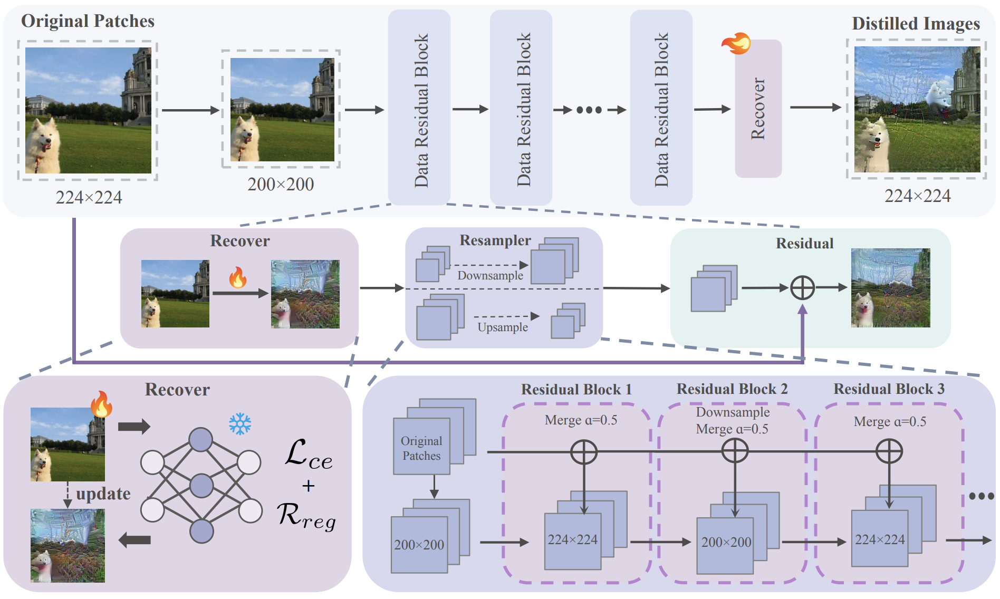
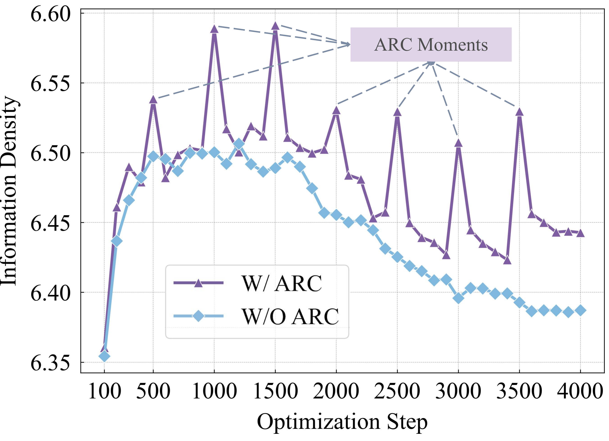
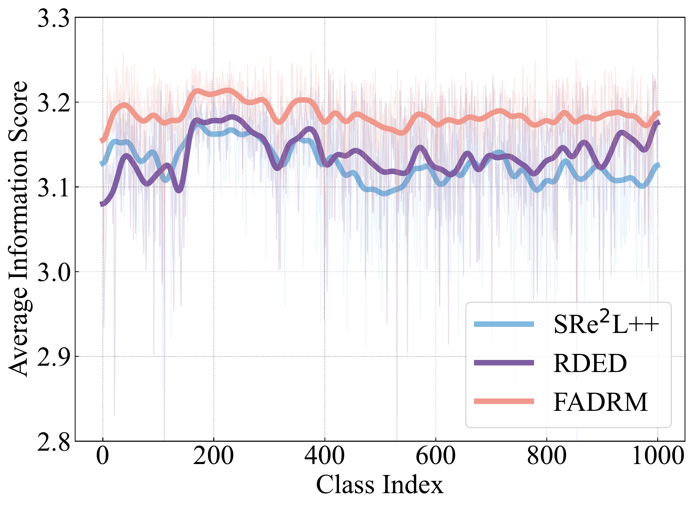
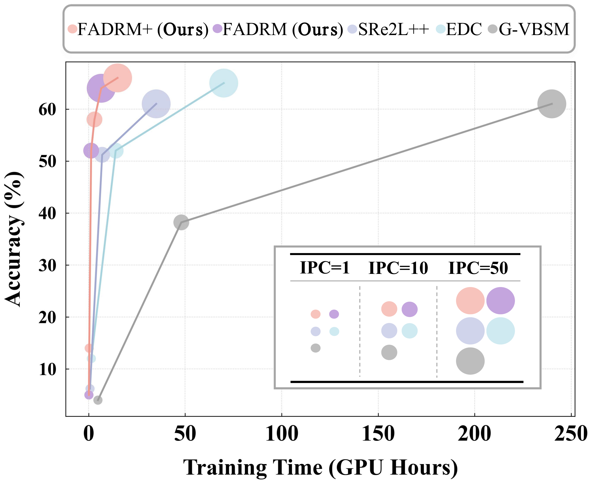
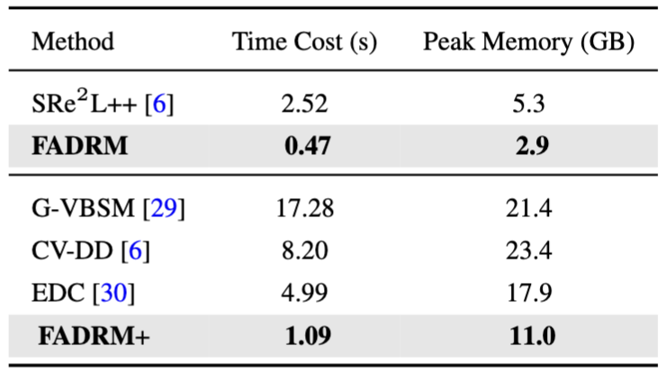
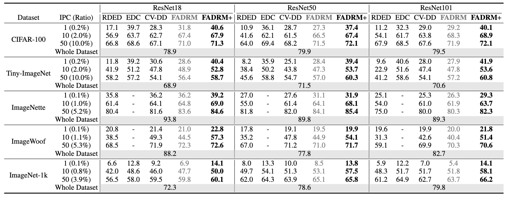

<h2 align="center"><em>Fast and Accurate Data Residual Matching for Dataset Distillation</em></h2>

<p align="center">
  <strong>
    Jiacheng Cui<sup>*1</sup>, Xinyue Bi<sup>*2</sup>, Yaxin Luo<sup>1</sup>, Xiaohan Zhao<sup>1</sup>, Jiacheng Liu<sup>1</sup>, Zhiqiang Shen<sup>†1</sup>
  </strong>
</p>

<p align="center">
  <sup>1</sup>VILA Lab, MBZUAI &emsp;&emsp; <sup>2</sup>University of Ottawa  
</p>

<p align="center">
  <sup>*</sup>Equal Contribution &emsp;&emsp; <sup>†</sup>Corresponding Author  
</p>


[]()
[]()
[](https://drive.google.com/drive/folders/1f2liYdUyxswBEFCrrDezDEvX1-5i7vqe?usp=drive_link)
[]()
[]()
[](./LICENSE)
[](mailto:Jiacheng.Cui@mbzuai.ac.ae)

## 📰 News
- 🚀 **[2025-06-20]** We’re thrilled to release **FADRM v1.0.0**, a complete project including pretrained models, evaluation scripts, and distilled datasets generated by our method. Everything is ready for plug-and-play reproducibility and benchmarking. 👉 [Grab it here](https://drive.google.com/drive/folders/1edM10M5isGhEOnuUagBbaTLYjt9xNVcs?usp=drive_link)


## 🔗 Table of Contents
- [Overview](#-overview)
  - [Contributions](#-contributions)
  - [Motivation](#-motivation)
  - [Efficiency Comparison](#-efficiency-comparison)
  - [Experimental Result](#-experimental-results)
- [Installation](#-installation)
- [Running Experiments](#-running-experiments)
- [Distilled Images](#-distilled-datasets)
- [Bibliography](#-bibliography)


## 🚀 Overview
Residual connection has been extensively studied and widely applied at the model architecture level. However, its potential in the more challenging data-centric approaches remains unexplored. In this work, we introduce the concept of ***Data Residual Matching*** for the first time, leveraging data-level skip connections to facilitate data generation and mitigate data information vanishing. This approach maintains a balance between newly acquired knowledge through pixel space optimization and existing core local information identification within raw data modalities, specifically for the dataset distillation task. Furthermore, by incorporating optimization-level refinements, our method significantly improves computational efficiency, achieving superior performance while reducing training time and peak GPU memory usage by 50\%. Consequently, the proposed method **F**ast and  **A**ccurate  **D**ata **R**esidual **M**atching for Dataset Distillation (**FADRM**) establishes a new state-of-the-art, demonstrating substantial improvements over existing methods across multiple dataset benchmarks in both efficiency and effectiveness. For instance, with ResNet-18 as the student model and a 0.8\% compression ratio on ImageNet-1K, the method achieves 47.7\% test accuracy in single-model dataset distillation and 50.0\% in multi-model dataset distillation, surpassing RDED by +5.7\% and outperforming state-of-the-art multi-model approaches, EDC and CV-DD, by +1.4\% and +4.0\%.

<p align="center">

</p>


### ⭐ Contributions

- 💡 **Data-Level Residual Design**  
  We extend conventional residual connection from the model level to the data level area, and present for the **first time** a simple yet effective, theoretically grounded residual connection
  design for data generation to enhance data-centric task.

- 🧠 **Novel Dataset Distillation Framework**  
  We introduce a novel dataset distillation framework based on the proposed **data residual matching**, incorporating multi-scale residual connections in data synthesis to improve both efficiency and accuracy.

- 📈 **SOTA Performance with Superior Efficiency**  
  Our method achieves **state-of-the-art results** across multiple datasets,such as CIFAR-100, Tiny-ImageNet and ImageNet-1k, while being more efficient and requiring less computational cost than all previous methods.


### 💡 Motivation

While uni-level optimization frameworks have achieved promising results in dataset distillation, they encounter two critical challenges that limit their practical utility:

- **📉 Information Vanishing**: As optimization progresses, the information density initially increases but eventually deteriorates due to the accumulation of local feature loss. This degradation leads to information vanishing, which significantly reduces the fidelity of the distilled images and limits their effectiveness in downstream tasks.
<div align="center">
  
  
</div>

- **🕒 High Computational Overhead**: Despite its effectiveness, large-scale data synthesis often incurs substantial computational and memory overhead, which hinders its practical deployment. As shown in Figure below, EDC takes nearly 70 hours to generate a 50-IPC distilled dataset, posing a significant bottleneck for scenarios requiring repeated experiments, large-scale synthesis, or thorough empirical evaluations.

<p align="center">

</p>

These limitations call for a more efficient and information-preserving approach to dataset distillation.


### ⚡ Efficiency Comparison

The table below highlights the **superior efficiency** of our framework compared to existing uni-level baselines, where the time cost is measured in seconds, representing the duration required
to generate a single image on a single RTX 4090 GPU:

- **FADRM+** (multi-model distillation) reduces optimization time by **3.9 seconds per image** over EDC, resulting in a total saving of **54 GPU hours** on the 50IPC ImageNet-1K setting.
- **FADRM** (single-model distillation) shortens training time by **28.5 hours** compared to SRe2L++ under the same configuration.
- Additionally, our method significantly lowers **peak GPU memory usage**, enabling efficient distillation on resource-constrained devices.

<p align="center">
  
</p>


### 📊 Experimental Results

We compare our Top-1 accuracy (%) under various IPC settings across standard benchmarks. As shown below, **FADRM and FADRM+ consistently outperforms state-of-the-art (SOTA)** uni- and multi-model distillation methods across multiple benchmarks.

<p align="center">
  
</p>


## 🛠️ Installation Guide

Follow these steps to set up the environment and access necessary resources:


### 📦 Step 1: Clone the Repository
```bash
git clone https://github.com/Jiacheng8/FADRM.git
cd FADRM
```


### 🧪 Step 2: Set Up Conda Environment
Create and activate the PyTorch environment using the provided configuration:
```bash
conda env create -f environment.yml
conda activate FADRM
```


### 📁 Step 3: Download Required Files
Some files must be downloaded manually from Google Drive. After downloading, update the corresponding paths in the `config.sh` file.

- 🔗 [Download Initialized Patches](https://drive.google.com/file/d/1GiK9lDu0b7TwXcgzdLl80YELXPKnz6RM/view?usp=drive_link)
- 🔗 [Download Pretrained Models](https://drive.google.com/file/d/1a7YjjX8Y8V_X0xD5Rb2OlXUYIMQSRhDt/view?usp=drive_link)
- 🔗 [Download Validation Images](https://drive.google.com/drive/folders/1BCWWdvo1MnwtTUIEK-t3QcS0KwwAMVqH?usp=drive_link)

> 📌 **Reminder:** Don’t forget to update `config.sh`!  
> Set `Main_Data_Path` to the folder where your generated data is saved, this is crucial for proper loading. Please put the pretrained models under the `Main_Data_Path`. There is no restriction for where you should put the patches or the validation set, as long as you update them correctly in `config.sh`.

### 🧩 Step 4: Modify PyTorch Source Code

To enable multi-processing loading of soft labels and mix configurations during FKD training, you need to modify the internal PyTorch class `torch.utils.data._utils.fetch._MapDatasetFetcher`.

Update the `fetch` method as follows:

```python
### 🔸 Original code
class _MapDatasetFetcher(_BaseDatasetFetcher):
    def fetch(self, possibly_batched_index):
        if self.auto_collation:
            if hasattr(self.dataset, "__getitems__") and self.dataset.__getitems__:
                data = self.dataset.__getitems__(possibly_batched_index)
            else:
                data = [self.dataset[idx] for idx in possibly_batched_index]
        else:
            data = self.dataset[possibly_batched_index]
        return self.collate_fn(data)

### 🔹 Modified code for FKD support
class _MapDatasetFetcher(_BaseDatasetFetcher):
    def fetch(self, possibly_batched_index):
        if hasattr(self.dataset, "mode") and self.dataset.mode == 'fkd_load':
            mix_index, mix_lam, mix_bbox, soft_label = self.dataset.load_batch_config(possibly_batched_index[0])

        if self.auto_collation:
            if hasattr(self.dataset, "__getitems__") and self.dataset.__getitems__:
                data = self.dataset.__getitems__(possibly_batched_index)
            else:
                data = [self.dataset[idx] for idx in possibly_batched_index]
        else:
            data = self.dataset[possibly_batched_index]

        if hasattr(self.dataset, "mode") and self.dataset.mode == 'fkd_load':
            return self.collate_fn(data), mix_index.cpu(), mix_lam, mix_bbox, soft_label.cpu()
        else:
            return self.collate_fn(data)
```

> ⚠️ **Note:** This is a low-level modification of PyTorch internals. Make sure to document and version-control the change to avoid compatibility issues during upgrades.


## 🚀 Running Experiments

All experiment pipelines are modularized into **three stages**:

1. 🧬 `recover/` — Generate the **distilled images**  
2. 🏷️ `relabel/` — Generate the corresponding **soft labels**  
3. 📊 `validate/` — **Evaluate** the performance of the distilled dataset

Each stage has its own shell scripts located under the corresponding `scripts/` directory.  
Here’s a step-by-step guide to run an experiment using **FADRM+** with **50 Images Per Class (IPC)**:


### 🧬 Step 1: Recover Distilled Images

To generate the distilled dataset (e.g., for `cifar100`, `imagenet1k`, etc.), run:

```bash
cd recover/scripts/<your_dataset_name>
bash recover_fadrm+_ipc50.sh
```

💡 Replace `<your_dataset_name>` with the actual dataset name (e.g., `cifar100`, `imagenet1k`, etc.)


### 🏷️ Step 2: Generate Soft Labels

Once the distilled images are ready, generate soft labels using:

```bash
cd relabel/scripts/<your_dataset_name>
bash relabel_fadrm+_ipc50.sh
```

🧠 The soft labels are generated using the teacher model(s) and are saved for supervised training.

### 📊 Step 3: Validate the Distilled Dataset

Before validation, **edit the corresponding script** (e.g., `validate_fadrm+.sh`) to set the following:

- `ipc`: Number of images per class (e.g., 50)  
- `model architectures`: Student model(s) to evaluate (e.g., `ResNet18`)

Then run:

```bash
cd validate/scripts/<your_dataset_name>
bash validate_fadrm+.sh
```

🧪 This will train student models on the distilled dataset and report accuracy metrics for benchmarking.

### ✅ Summary Table

| Stage     | Description                     | Directory              |
|-----------|---------------------------------|------------------------|
| Recover   | Generate distilled images        | `recover/scripts/`     |
| Relabel   | Generate soft labels             | `relabel/scripts/`     |
| Validate  | Evaluate distilled performance   | `validate/scripts/`    |

Feel free to customize each script with your preferred hyperparameters, architectures, or IPC settings.  
The provided configurations are designed to **reproduce the results reported in the paper**, but you are encouraged to explore beyond them.


## 🧬 Distilled Datasets

You can access all distilled datasets from the following Drive folder:

👉 [**Browse Distilled Datasets on Google Drive**](https://drive.google.com/drive/folders/1f2liYdUyxswBEFCrrDezDEvX1-5i7vqe?usp=drive_link)

> 💡 *This includes distilled versions of CIFAR-100, Tiny-ImageNet, ImageNet-1K, Imagenette, ImageWoof*


## 📚 Bibliography

If you find this repository helpful for your research or project, please consider citing our work:

> 🔖 **Citation (BibTeX):**
```bibtex

```

📌 *Your citation helps support and acknowledge our research contributions to the dataset distillation community.*
